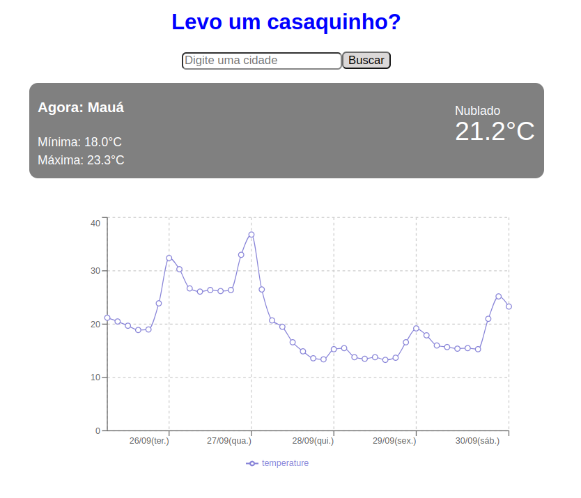

# Weather Forecast

This project is the front-end interface for a weather forecast application. Uses React with Vite as a build tool.

## How to run for development

1. Clone this repository
2. Install all dependencies

```bash
npm i
```
3. Populate `.env` file based on `.env.example` 
```bash
    VITE_API_WEATHER_KEY=SECRET_KEY
```
    You can generate your key at: https://openweathermap.org/


4. Run the front-end in a development environment:

```bash
npm run dev
```

## Alternatively, you can use the Docker image:

1. Pull the Docker image

```bash
docker pull nishiyama13/weather-forecast
```

    1.1. Remove any existing container (if applicable):

```bash
docker rm -f weather-forecast1 || true
```

2. Run the Docker container
```bash
docker run -p 8080:80 --name weather-forecast1 nishiyama13/weather-forecast:1.0
```

3. Now you can access the application at http://localhost:8080

### Docker Repository Link:
[Docker Repository](https://hub.docker.com/repository/docker/nishiyama13/weather-forecast/general)
```bash
https://hub.docker.com/repository/docker/nishiyama13/weather-forecast/general
```


## You can test the application at:
[Weather Forecast Demo](https://weather-forecast-three-mu.vercel.app/)
```bash
https://weather-forecast-three-mu.vercel.app/
```



